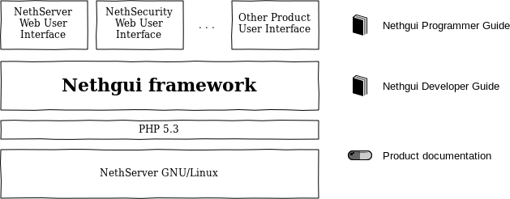

=============
Web interface
=============

The web interface is the main configuration method for NethServer.
The main goal is to hide the system configuration complexity behind a simple and clear interface.

It runs on a special httpd instance and is accessible at: ``https://your_server:980`` or ``https://your_server/server-manager`` (if nethserver-httpd module is installed).

Nethgui framework
=================

Nethgui framework is provided with a set of components and basic classes to quickly build a modern web user interface. Its main goals are:

* provide a simplified API for coding, localizing and realizing the web user interface and behaviour for project:NethServer based products.
* perform user authentication and authorization;
* offer test facilities to help module testing and debugging.

Key features:

* Object-oriented and embeddable
* Plugin support
* REST-aimed architecture
* Almost no external dependencies
* User roles
* AJAX driven HTML5 Widget library
* Unobtrusive JavaScript code
* Compatible with console-based and mobile browsers

*NethServer Web User Interface* is built upon Nethgui framework.

